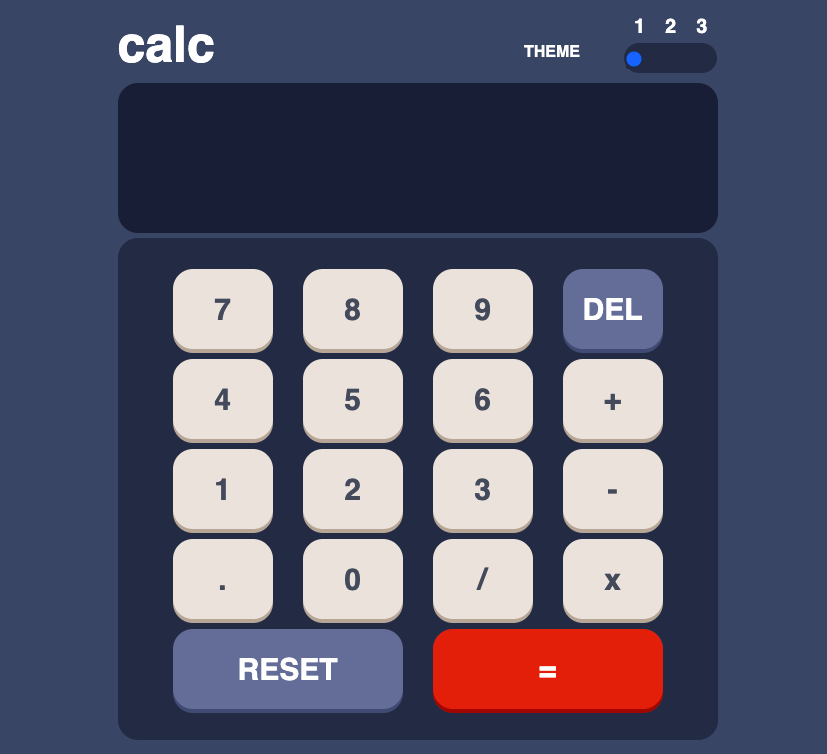

## Table of contents

- [Overview](#overview)
  - [The challenge](#the-challenge)
  - [Screenshot](#screenshot)
  - [Links](#links)
- [My process](#my-process)
  - [Built with](#built-with)
  - [What I learned](#what-i-learned)
- [Author](#author)
- [Acknowledgments](#acknowledgments)


## Overview

### The challenge

Users should be able to:

- See the size of the elements adjust based on their device's screen size
- Perform mathmatical operations like addition, subtraction, multiplication, and division
- Adjust the color theme based on their preference


### Screenshot



### Links

- Live Site URL: [Add live site URL here](https://your-live-site-url.com)

## My process

### Built with

- Semantic HTML5 markup
- SCSS
- Flexbox
- CSS Grid
- Mobile-first workflow
- JavaScript XML
- [React](https://reactjs.org/) - JS library


### What I learned


This project was a great exercise for me and a chance for me to consolidate the routine of setting up a brand new React project. Essential skills like mapping an array of objects and adding functionality on each item depending on the id. the eval() function is a great find, which allows strings to be directly "evaluated" and in this case, calculated from a lot of strings joined together.


```js
//using eval to directly calculate the string and outputs integers
      const result = eval(this.state.calculate.join(''))
      
      this.setState({
        //rounding up the result to 2 decimal points
        display: Math.round(result * 100) / 100 ,
        calculate: [Math.round(result * 100) / 100]
      })
```
```js

      {this.state.numpad_array.map(item => {
        return <li key={item.name.toString()}>
                <button id={item.name.toString()} onClick={this.handlechange}>{item.value}</button>
              </li>
      })}
```
The theme changes are handled really efficiently by simply changing the theme class from the state.
```js
      handleToggle(key, value){
          this.setState({ [key] : value})
          if (value == 1) {
            this.setState({ theme: 'style-a' })
          } else if (value == 2) {
            this.setState({ theme: 'style-b' })
          } else if (value == 3){
            this.setState({ theme: 'style-c' })
          }
        }
```


## Author

- Website - [David Tsui](https://davidtsui.co.uk)


## Acknowledgments

Thanks to Frontend Mentor for the challenge!
